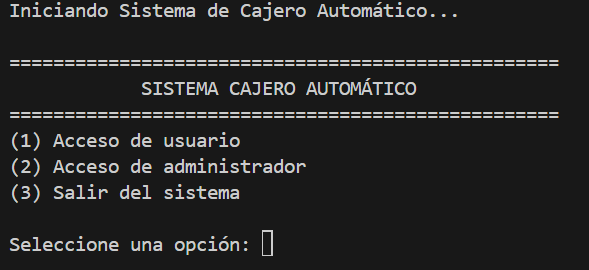

<h1 align="center" >ATM in Python</h1>

<p>This project implements a comprehensive automated teller machine (ATM) system in Python, designed with a modular, object-oriented architecture. It offers support for both users and administrators, incorporating secure authentication via hashed PIN, complete account management, control of daily and per-transaction withdrawal limits, as well as deposit operations, balance inquiries, and credential changes. It also guarantees data persistence in JSON format, records transactions in log files, and offers advanced administration tools that allow information to be exported to CSV files and generate detailed reports for system auditing and control.</p>

<p>1- First step run the program</p>

```bash
# run the program in Python
python3 ATM.py
```
<p>and it should give you something like this in the terminal</p>



```bash
# Account number
123456
```

```bash
# 4-digit PIN
1234
```

<p>administrator access</p>

